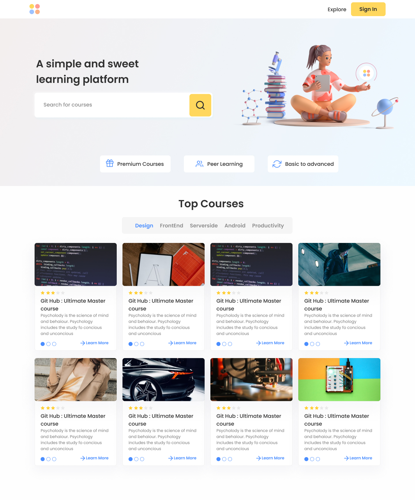

# SWC Courses

**Enjoy your favourite courses on campus intranet !**

SWC Courses is an online learning platform for campus junta. You can stream courses online, an admin panel with various customizations like add or delete admins and features like add courses, add videos, and update and delete them thumbnail uploading for course.

Encoding of videos after uploading into MPEG-DASH, automatic generation of thumbnails of course videos using FFmpeg.

## Screenshots

### On Desktop

### On Mobile

